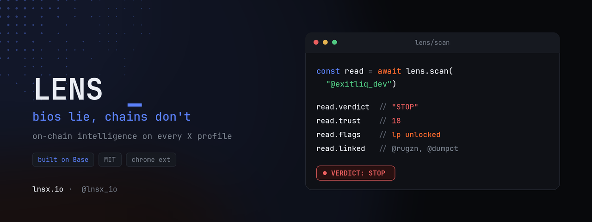

<div align="center">

# LENS

### bios lie, chains don't

on-chain intelligence on every X profile

[](LICENSE)
[](https://base.org)
[](https://lnsx.io)
[](https://x.com/lnsx_io)

[Website](https://lnsx.io) · [Docs](https://lnsx.io/lens-docs) · [Demo](https://lnsx.io) · [Report a bug](https://github.com/Tholynceus/Lens/issues)

</div>

---

## Demo

<div align="center">

<a href="https://lnsx.io"></a>

</div>

---

## The problem

every account on crypto Twitter is a pitch.

the avatar, the blue check, the bio that says building, the screenshot of green candles, all of it is chosen, all of it can be faked.

the wallet underneath cannot.

every deploy, every sell, every fee claim, every wallet that quietly funded the dev sits on-chain and never gets curated. the problem was never missing data. the problem was that reading it meant juggling block explorers, pasting addresses, and squinting at logs while the token already moved.

LENS closes that gap.

---

## What it is

LENS reads the deployer wallet behind any X profile and flags rug patterns inline, before you ape.

A Chrome extension plus a web agent. No wallet connect, no setup, only public on-chain data.

```js
// read a dev before you trust them
const read = await lens.scan("@exitliq_dev")

read.verdict   // "STOP"
read.trust     // 18
read.flags     // ["lp unlocked", "95% fees", "5 of 6 tokens dumped"]
read.linked    // ["@rugzn", "@dumpct"]
```

The read lands right on the profile, under the bio, where you were already looking. No new tab, no extra app. The answer comes to you.

---

## How it works

```txt
   X profile
      │  open any handle
      ▼
  LENS extension  ──►  GET /api/lookup?username=
                              │
                              ▼
                       backend on Vercel
                       │       │        │
                  Supabase  Alchemy  Bankrbot feed
                       │       │        │
                       └───────┴────────┘
                              │
                              ▼
            verdict rendered inline on the profile
```

1. The extension resolves the deployer wallet linked to the profile
2. It calls the backend, which pulls the wallet's full history from Alchemy on Base
3. Recent launches come from the Bankrbot feed, indexed into Supabase by a cron job
4. Signals get scored into one verdict and rendered inline, in seconds

---

## The four layers

Every profile is read across four layers. Each one is a question you used to answer by hand.

### AI Verdict
A plain-language risk call, `CLEAR`, `CAUTION`, or `STOP`, with the exact red lines that triggered it. Never a vibe, always the receipts.

### Token Health
How much of supply the dev is holding, whether liquidity is locked, and the real dump risk, not the promised one.

### Linked Accounts
The other X profiles sharing the same wallet. The fake crowd is usually one person with five handles.

### Funding Trail
Who funded the dev, and which sibling wallets that funder keeps spinning up. The serial deployer pattern in plain sight.

---

## Reading a verdict

```diff
+ CLEAR     the on-chain history backs up the pitch, nothing alarming
! CAUTION   something is worth a second look before you size in
- STOP      the pattern matches how rugs actually behave, get out of the way
```

The verdict is a signal, not a guarantee. LENS shows its reasoning under every call so you can decide for yourself.

---

## Install

### Extension (for users)

The Chrome Web Store listing is on the way and currently in review. To run it now, load it unpacked:

```txt
1. download the extension build from lnsx.io
2. open chrome://extensions
3. turn on Developer mode (top right)
4. click "Load unpacked" and select the folder
5. open any X profile, LENS reads it inline
```

### Self-host the backend (for devs)

```bash
git clone https://github.com/Tholynceus/Lens
cd Lens
npm install
```

Set your env in the Vercel dashboard, never commit these:

```bash
LENS_SUPABASE_URL=
LENS_SUPABASE_SERVICE_KEY=
LENS_SUPABASE_ANON_KEY=
ALCHEMY_API_KEY=
CRON_SECRET=
```

Then ship it:

```bash
vercel --prod
```

Point the extension config at your deployment:

```bash
LENS_API_URL = https://your-deployment.vercel.app
```

---

## API

One call, any X handle, full on-chain read.

```bash
curl "https://lens-liard.vercel.app/api/lookup?username=exitliq_dev"
```

```json
{
  "username": "exitliq_dev",
  "verdict": "STOP",
  "trust": 18,
  "tokens": 6,
  "devSells": "3.4B",
  "feeShare": "95%",
  "lpLocked": false,
  "linked": ["@rugzn", "@dumpct"]
}
```

| endpoint | method | what it does |
| --- | --- | --- |
| `/api/lookup?username=` | GET | on-chain read for any X profile, called by the extension |
| `/api/index-launches` | GET | cron, pulls Bankrbot launches into Supabase every 5 min |

---

## Project structure

```txt
Lens/
├─ api/
│  ├─ lookup.js          on-chain read for a handle
│  ├─ index-launches.js  cron, Bankrbot feed -> Supabase
│  └─ ...                verdict, funding trail, linked accounts
├─ schema.sql            Supabase tables
├─ vercel.json           routes + cron config
├─ package.json
└─ README.md
```

---

## Tech

```txt
runtime    Node + Vercel Serverless Functions
schedule   Vercel Cron  ( /api/index-launches )
data       Supabase
chain      Alchemy  ·  Base
source     Bankrbot launch feed
```

---

## Roadmap

```diff
+ AI Verdict          shipped
+ Token Health        shipped
+ Linked Accounts     shipped
+ Funding Trail       shipped
- Cabal Wallet        coming soon
- Smart Followers     coming soon
- GitHub Intel        coming soon
- Username History    coming soon
```

---

## FAQ

**Does LENS need my wallet?**
No. It never asks you to connect a wallet. It reads only public data.

**Is my data safe?**
LENS reads public on-chain history and public profile data. Nothing private, nothing about you is stored.

**Does it cost anything?**
No. LENS is free.

**Which chain?**
Base, with launches sourced from the Bankrbot feed.

**Can it be wrong?**
It is a signal, not a verdict from god. Every call shows the reasoning behind it so you can judge for yourself.

---

## Contributing

Building in public. Issues and PRs are welcome.

```bash
# fork, branch, ship
git checkout -b fix/your-thing
git commit -m "fix: your thing"
# open a PR
```

If you find a false positive or a dev LENS should have caught, open an issue with the handle and the contract address.

---

## Disclaimer

LENS surfaces public on-chain signals to help you make your own call. It is not financial advice. Always do your own research before you put money anywhere.

---

## Connect

- Website  ·  [lnsx.io](https://lnsx.io)
- Docs  ·  [lnsx.io/lens-docs](https://lnsx.io/lens-docs)
- Project  ·  [@lnsx_io](https://x.com/lnsx_io)

---

<div align="center">

```js
// bios lie, chains don't
lens("@exitliq_dev")  // STOP
```

MIT © Thoth Lynceus

</div>
